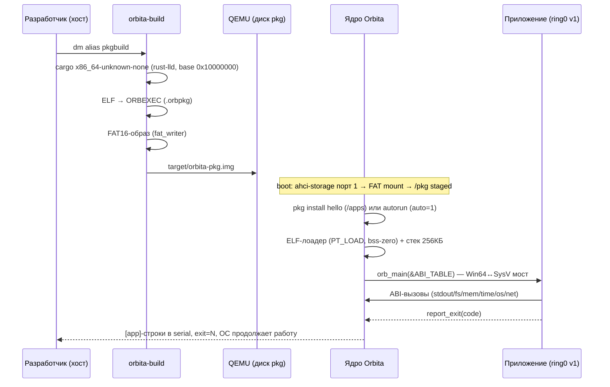
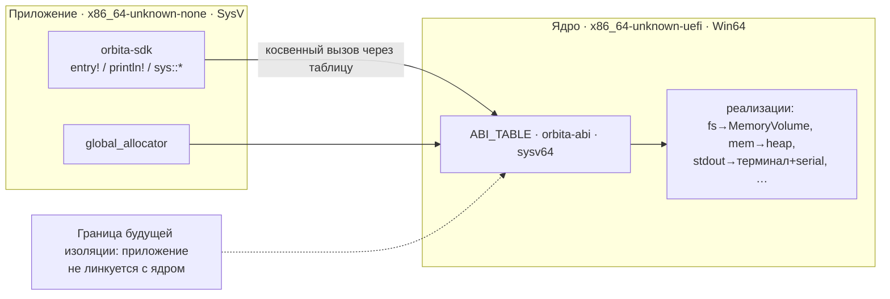

# ABI, приложения и пакеты

Как Rust-приложение собирается на хосте, доставляется в ОС и исполняется
нативно.

## Жизненный цикл приложения



## Слой ABI




## Поток данных

```
apps/<name>/src/main.rs
  │ orbita-sdk: entry! { fn main() -> i32 { … } }
  ▼  dm alias pkgbuild  (orbita-build)
cargo rustc --target x86_64-unknown-none
  (rust-lld, линкер-скрипт: база 0x1000_0000, ENTRY(orb_main), static)
  ▼
ELF64 (ET_EXEC, va==pa)
  ▼  оборачивание
hello.orbpkg  = ORBEXEC-контейнер (манифест name/entry/base/auto + ELF)
  ▼  orbita-fs::fat_writer
target/orbita-pkg.img  (FAT16, файлы в /pkg; свой писатель = свой читатель)
  ▼  QEMU: -device ide-hd,bus=orbita_ahci.1  (порт 1 AHCI)
ядро: ahci-storage драйвер → FatVolume::mount → копия /pkg в RAM-том
  ▼  в ОС
pkg install hello → /apps/hello.orbexec   (или авто: auto=1 в манифесте)
run hello → ELF-лоадер (PT_LOAD, bss-zero) → orb_main(&ABI_TABLE)
  ▼
[app] строки в терминал+serial → report_exit(code) → exit=N
```

## ABI (`orbita-abi`)

Версионированная C-ABI таблица, все записи `extern "sysv64"`:

| Поле | Назначение |
|---|---|
| `stdout_write` | строка вывода приложения |
| `fs_read` / `fs_write` / `fs_list` / `fs_delete` | файлы на живом томе |
| `mem_alloc` / `mem_free` | куча приложения (через kernel heap) |
| `time_ms` | монотонное время |
| `os_info` | сводка ОС (версия, рендерер, CPU, куча) |
| `net_interfaces` | сетевые интерфейсы |
| `report_exit` | код возврата (надёжнее rax между ABI) |

Приложение не линкуется с ядром: только косвенные вызовы через таблицу —
граница для будущей изоляции (user-mode, roadmap).

## SDK (`orbita-sdk`)

```rust
#![no_std] #![no_main]
use orbita_sdk::{println, sys::{fs, net, os, time}};

orbita_sdk::entry! {
    fn main() -> i32 {
        println!("hello {x}");            // format + alloc через ABI
        fs::write("/home/note", b"…")?;   // файлы ОС
        os::info(); time::now_ms();
        net::interfaces();                 // сокеты — ABI v2 (roadmap)
        0
    }
}
```

Глобальный аллокатор приложения (`String`/`Vec`) ходит через
`mem_alloc`/`mem_free` таблицы.

## Исполнение (v1, честные ограничения)

- ring0, identity-mapped; образ загружается в зарезервированный на старте
  регион `0x1000_0000` (1 MiB), стек — отдельные 256 KiB из kernel heap;
- ядро (Win64-таргет) ↔ приложение (SysV-таргет): naked-трамплин
  переключает стек и сохраняет rdi/rsi (см. `kernel/src/abi.rs`,
  `call_with_stack`);
- паника приложения печатает сообщение и останавливает систему
  (user-mode это исправит — roadmap);
- `ORBITA_QEMU_EXTRA` и headless-проверка: `autorun`-приложения
  (`auto=1` в манифесте) ставятся и запускаются при каждом буте.

## Хост-инструмент (`orbita-build`)

- `orbita-build new <name>` — скаффолд приложения (или `dm alias appnew`);
- `orbita-build pack <dir>` / `pack-all` — сборка+упаковка+FAT-образ
  (`dm alias pkgbuild`);
- маркер `auto = true` в `[package.metadata.orbita]` включает автозапуск.

## Форматы

- **ORBEXEC** (`orbita-process/src/format.rs`): magic `ORBEXEC\0`,
  version, flags(root), api-version, manifest_len, payload_len,
  `key=value`-манифест, payload (ELF).
- **.orbpkg** — тот же ORBEXEC-контейнер, имя файла = имя пакета.
- **FAT-доставка** — FAT16-образ, файлы в `/pkg`; читатель в ОС —
  `orbita-fs::fat` (FAT12/16/32, LFN, read-only).
