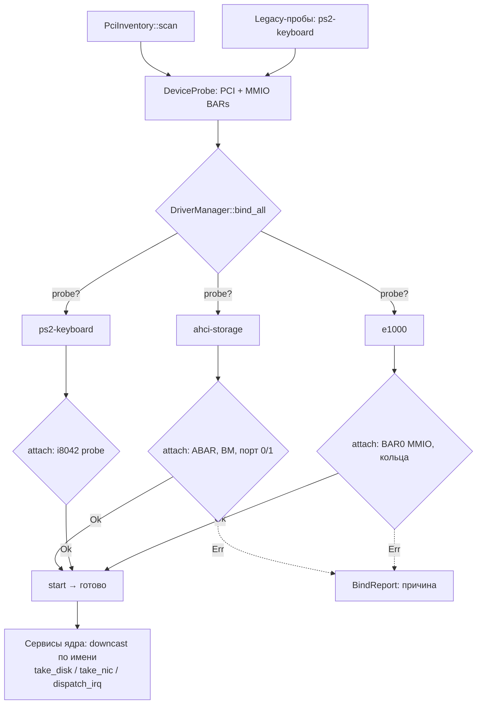

# Драйверная платформа Orbita

Единый контракт для всех драйверов: `orbita-drivers/src/driver.rs`.

## Контракт

```rust
pub trait Driver {
    fn name(&self) -> &'static str;              // "ahci-storage", "e1000"
    fn class(&self) -> DeviceClass;              // Storage | Input | Net | ...
    fn probe(&self, device: &DeviceProbe) -> bool;   // моё ли устройство?
    fn attach(&mut self, device: &DeviceProbe) -> Result<(), &'static str>;
    fn start(&mut self) -> Result<(), &'static str>;
    fn handle_irq(&mut self) {}                  // опционально
    fn stop(&mut self) {}
    fn as_any(&mut self) -> &mut dyn Any;        // для downcast сервисами
}
```

`DeviceProbe` — наблюдение устройства: PCI (адрес, vendor/device id,
class/subclass, MMIO BAR-ы) или legacy (`ps2-keyboard`).

## Пайплайн привязки



```
kernel_main:
  probes = pci_probes(&PciInventory) + legacy-пробы
  let (mut manager, report) = bind_builtin_drivers(&probes);
  // manager.bind_all: для каждого устройства — первый драйвер,
  // чей probe+attach+start успешен, забирает устройство
```

Регистрация драйверов — `bind_builtin_drivers` (kernel/src/drivers.rs);
внешние драйверы-пакеты будут добавляться `manager.register(...)` (этап
«драйверы как пакеты» в roadmap).

## Реальные драйверы (референсы)

| Драйвер | Файл | Что демонстрирует |
|---|---|---|
| `ahci-storage` | kernel/src/drivers.rs | PCI-класс 01/06, BAR (ABAR), DMA, два диска на одном контроллере |
| `ps2-keyboard` | kernel/src/drivers.rs | legacy-устройство, i8042 |
| `e1000` | kernel/src/drivers.rs + orbita-hw/src/e1000.rs | MMIO BAR0, EEPROM MAC, RX/TX кольца, poll-режим |

## Сервисный доступ

```rust
// получить конкретный драйвер по имени:
let disk = driver_manager
    .by_name_any("ahci-storage")
    .and_then(|any| any.downcast_mut::<AhciStorageDriver>())
    .and_then(|d| d.take_disk());
```

## Свой драйвер — чеклист

1. `impl DriverTrait for MyDriver` (probe — по PCI id или class/subclass,
   либо legacy-строка).
2. В `attach`: взять BAR (`device.pci_mmio_bar(n)`), включить bus master,
   инициализировать железо; тяжёлое — в `start`.
3. Зарегистрировать в `bind_builtin_drivers` (или своим `register`).
4. Прерывания: `DriverManager::assign_irq(name, vector)` + `dispatch_irq`.
5. Тесты чистой логики (кольца/парсеры) — host-side `#[cfg(test)]`.

## Контракты по классам (roadmap: семейства)

`BlockDriver` / `NetDriver` / `InputDriver` / `DisplayDriver` — унифицируют
сервисный слой над драйверами одного класса; сейчас трафик идёт через
конкретные типы (`AhciDisk`, `E1000`), взятые downcast-ом.
