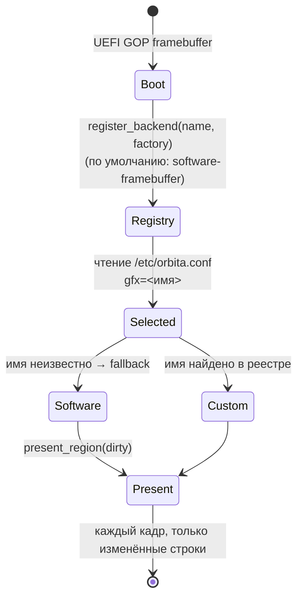

# Графика: подменяемый бэкенд

По умолчанию — программный рендер в линейный framebuffer (UEFI GOP).
Любой другой движок (virtio-gpu, Vulkan, DRM-scanout) подключается
модулем-драйвером без изменения потребителей.

## Архитектура

```
orbita-desktop (сцены, dirty-rect scopes)
        │ рисует в
        ▼
FrameCompositor (swapchain BackBuffer'ов)      orbita-video/src/backend.rs
        │ present_region(dirty) через
        ▼
Box<dyn PresentBackend>  ◄── реестр бэкендов ── register_backend("vulkan", factory)
        │
        ├── SoftwareFramebuffer (дефолт: копирование строк в GOP)
        └── <ваш бэкенд>
```

## Точки расширения

- `PresentBackend` (`orbita-video::PresentBackend`):
  - `info() -> BackendInfo` — имя, API, present-режим, глубина swapchain;
  - `present_region(pixels: &[Color], stride, region)` — публикация
    готового региона (dirty-rect контракт сохраняется).
- Реестр: `orbita_video::register_backend(BackendInfo, factory)` —
  фабрика получает `FramebufferInfo` (scanout-параметры).
- Выбор: `/etc/orbita.conf`, ключ `gfx=<имя>` (неизвестное имя →
  fallback на software).

## Свой бэкенд — пример скелета

```rust
struct VulkanBackend { /* device, queues, swapchain */ }

impl orbita_video::PresentBackend for VulkanBackend {
    fn info(&self) -> orbita_video::BackendInfo {
        BackendInfo { name: "vulkan", api: "vulkan-1.3",
                      present_mode: "mailbox", swapchain_len: 3,
                      accelerated: true }
    }
    fn present_region(&mut self, pixels: &[Color], stride: usize, region: Rect) {
        // загрузить `region` буфера и поставить present
    }
}

// регистрация на старте модуля-драйвера:
orbita_video::register_backend(
    BackendInfo { name: "vulkan", .. },
    |fb| Box::new(VulkanBackend::new(fb)),
);
```

## Пользовательский переключатель

Настройки (`g`) циклически меняют предпочтение; ядро пересоздаёт
композитор через `create_backend(preference.label(), framebuffer.info)`.

## Дальше (roadmap)

- virtio-gpu: 2D host blits (QEMU) — первый ускоренный бэкенд;
- композитор per-window surfaces + vsync-презент;
- GPU memory manager и загрузка пикселей без CPU-копий.

## Выбор бэкенда (runtime)


