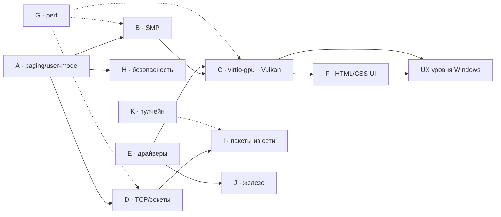

# Orbita OS — Мастер-план (сверхподробный)

Стек: Rust `no_std`, UEFI x86_64, QEMU (OVMF) + реальное железо (цель).
Миссия: самая быстрая, современная, кастомизируемая ОС — UX уровня
Windows, модульность уровня Linux. Ядро даёт минимальный фундамент,
вся функциональность — модули на его «орбите» (крейты вокруг ядра).
Репозиторий: `C:\Projects\orbita`. Сборка/запуск: `dm` (см. `dm.yaml`).

---

## Этап 0 — Фундамент (ГОТОВО, факты)

### 0.1 Модульное ядро — 23 крейта
`abi, arch-x86_64, async, build, core, desktop, drivers, fs, hw, kernel,
mm, net, platform, process, proto, runtime, scheduler, sdk, shell, std,
sync, threading, video` (все в `crates/`). Монолит `orbita-kernel/src/main.rs`
разрезан на модули `boot, console, config, disk, drivers, seed, ui, input,
hosts, abi` — рефакторинг продолжается (см. «Непрерывный трек»).

### 0.2 Драйверная платформа
- `crates/orbita-drivers/src/driver.rs` — trait `Driver`:
  `probe → attach → start → stop/irq`.
- `manager.rs` — `DriverManager`: динамическая регистрация, `bind_all`,
  IRQ-таблица, downcast по имени; плюс `registry.rs`, `monitor.rs`,
  `device.rs`, `domains.rs`.
- Реальные драйверы: **AHCI** (`src/block/`, порт 0 = OrbitaFS,
  порт 1 = pkg-диск, DMA), **PS/2 клавиатура**, **e1000** (MMIO,
  RX/TX-кольца, poll-режим, MAC из EEPROM; работает с QEMU user-net
  10.0.2.15/24, gw 10.0.2.2).

### 0.3 Графика
- `crates/orbita-video/src/backend.rs`: trait `PresentBackend`
  (`present_region` dirty-rect), `SoftwareFramebuffer` — дефолт;
  глобальный реестр `register_backend("vulkan", factory)`,
  `create_backend(name, scanout)`.
- Выбор бэкенда из `/etc/orbita.conf` (`gfx=...`) на раннем boot.
- `FrameCompositor` агностичен (`Box<dyn PresentBackend>`),
  двойная буферизация + dirty-rect (`framebuffer.rs`, `present_region`).
- EDID-парсер (`edid.rs`), шрифт/текст/примитивы (`font.rs`, `text.rs`,
  `primitives.rs`).

### 0.4 Сеть
- Чистый стек: `ethernet.rs, arp.rs, ipv4.rs, icmp.rs, udp.rs, tcp.rs`
  (parse/build, 25+ host-тестов).
- `stack.rs` — живой `NetworkStack`: e1000 rx → `stack.receive` → events,
  `pending_tx` → `nic.send`, ARP автоответ, ICMP echo reply,
  `send_arp_request` / `send_icmp_echo_request` / `take_tx_frame`.
- `ping` в shell (ARP→ICMP→poll с таймаутом); `netcfg` показывает live
  rx/tx-счётчики. `wifi.rs`/`bluetooth.rs` — модели данных + контракты
  API (транспорты не реализованы).

### 0.5 Конвейер Rust-приложений (сквозной, работает)
`orbita-sdk` (`entry!` макрос, `println!`, `sys::{fs,net,os,time,process}`,
глобальный аллокатор поверх ABI) → `cargo build` под
`x86_64-unknown-none` (rust-lld, линкер-скрипт, база 0x10000000,
`-eorb_main`) → ORBEXEC-контейнер `.orbpkg` → FAT16-образ доставки
(`orbita-fs::fat_writer`, свой писатель+читатель, LFN) → QEMU-диск →
ядро монтирует `/pkg` (FAT12/16/32 ro, `fat.rs`) → `pkg install|list|remove`
в shell → `run <name>` → ELF64-лоадер (`process/exec.rs`, PT_LOAD,
bss-zero) → нативный вызов `orb_main` с ABI-таблицей → вывод `[app]` в
терминал+serial → exit code. Работают: `hello` (println + fs write/read),
`sysinfo` (os_info + time + net + list_dir).
**Важно (ограничение v1):** приложения исполняются в ring0,
identity-mapped, на выделенном стеке 256KB, с Win64↔SysV ABI-мостом.

### 0.6 orbita-abi
`crates/orbita-abi/src/lib.rs` — версионированная C-ABI таблица
(stdout, fs read/write/list/delete, mem_alloc/free, time_ms, os_info,
net_interfaces, report_exit), всё sysv64.

### 0.7 Память
`BootstrapFrameAllocator` + свой heap (free-list, коалесинг, realloc)
в `orbita-mm/src/lib.rs`; `orbita-mm/src/vm.rs` — `RegionMap`
(map/unmap/protect, `Protection` RW/RO/RX, `Backing`
Heap/Image/Shared), `SharedMemoryRegistry` для IPC. Пейджинга нет
(вся память identity-mapped).

### 0.8 Хранилище
OrbitaFS (`diskfs.rs, inode.rs, extent.rs, superblock.rs, volume.rs,
mount.rs` — свои inode/extents/bitmap/superblock, host-тесты).
Исправлен критический баг исходной ОС: `list_dir("/")` листил сам корень
→ бесконечная рекурсия → triple fault. `/etc/orbita.conf` живой
(hostname, gfx=, smp=). AHCI DMA. FAT ro — только доставка пакетов.

### 0.9 Процессы, shell, dm, тесты
- ORBEXEC-формат (`process/format.rs`), `ProcessEngine` (pid, fds,
  состояние) в `process/exec.rs`; `ps` в shell; нативный exec.
- Shell (`shell/parser.rs, command.rs, runtime.rs`): пайпы/редиректы/
  переменные/env, реальный `pkg`, `run/ps/ping/netcfg`. Фейковые
  python/gcc/cargo-тулчейны УДАЛЕНЫ.
- `dm build`: 0. apps → 1. kernel → 2. esp → 3. firmware; алиасы
  pkgbuild/appnew/test/doc/run/os/doctor; hot-reload `dm start`.
- ~75 host-тестов (net 25, fs 12, drivers 5, mm 8, std 11, video 6,
  process 5…); QEMU smoke headless: boots=1, оба app exit=0.

---

## Текущее состояние vs Цель

| Подсистема | Сейчас | Цель | Статус |
|---|---|---|---|
| Загрузка | UEFI→kernel, OrbitaFS, orbita.conf | То же + реальное UEFI-ПК, EDID | готово (QEMU) |
| Память | **свои page tables в CR3** (0..4GiB + >4GiB identity, 2MiB huge, включено по умолчанию), #PF/#GP/#DF-обработчики с диагностикой; Protection в RegionMap всё ещё декоративен | user/kernel split, CoW, аппаратный Protection | частично (пейджинг ядра есть) |
| Процессы | ORBEXEC ring0, pid/fds, ELF-лоадер | ring3, изоляция, fork/exec, panic-safe | частично |
| Планировщик/CPU | round_robin (`scheduler/round_robin.rs`), 1 CPU фактический | per-CPU runqueues, preempt, tickless, IPI | частично |
| Драйверы | Driver-платформа + AHCI/PS2/e1000 | NVMe, xHCI, HDA, virtio, pkg-драйверы | частично |
| Сеть | Eth/ARP/IP/ICMP/UDP/TCP parse/build + e1000 live | DHCP, TCP-коннекты, DNS, HTTP(S), сокеты в SDK | частично |
| Графика | PresentBackend + soft FB + dirty-rect | virtio-gpu DMA, Vulkan ICD, vsync-композитор | частично |
| Приложения | Rust SDK → orbpkg → run, 2 приложения | ring3 + сокеты + UI + подпись пакетов | частично |
| UI | desktop-рендер, терминал на FB | HTML/CSS+Rust платформа, темы, 60fps | нет (задел — план Этапа F) |
| Пакеты | pkg install/list/remove, FAT-доставка | registry, версии/зависимости, подпись, обновление | частично |
| Безопасность | изоляции нет (ring0) | ring3, подпись, capabilities, fuzz, watchdog | нет/частично |
| Производительность | не измеряется системно | orbita-bench, бюджеты латентности | нет |
| Тулчейн в ОС | — (фейки удалены) | self-hosting rustc/cargo или WASM-рантайм | нет |

## Известные ограничения v1 (честно)

1. **Приложения в ring0 — СНЯТО частично (порция 7)**: hello и sysinfo
   исполняются в **ring 3** (iretq CS=0x2B, syscall-шлюз ABI v2, EXIT-
   развязка, `apps_ring3=on` по умолчанию; CI-маркеры autorun3).
   Осталось: #PF в ring3 → kill процесса (сейчас halt ядра с
   диагностикой), per-process адресные пространства, user-ELF по
   стандартной базе 0x400000 (сейчас identity-регион 0x10000000).
2. **Фактически один CPU**: `probe_smp()` (orbita-kernel/src/main.rs:324)
   только инвентаризирует топологию; `bring_up_aps()`
   (orbita-arch-x86_64/src/smp_ap.rs:157, INIT-SIPI-SIPI + trampoline
   16→64-бит) вызывается лишь при `smp=1` в /etc/orbita.conf, и на
   OVMF/QEMU AP не выходят из park — исполняется только BSP.
3. **Паника приложения в ring0-пути**: SDK panic печатает и exit'ит —
   в ring3 ядро продолжает (порция 7); в ring0 (pre-switch автораны)
   всё ещё spin. #PF/#GP в ring3 сейчас = halt ядра с диагностикой;
   kill процесса по fault — порция 8 (roadmap A.7).
4. **TCP: state machine готова** (этап D, порция 1: `tcp_state.rs`,
   11 состояний RFC 793, 21 host-тест), но интеграции в stack.rs ещё
   нет — коннектов в живой ОС пока нет (сокет-слой, порция 2).
5. **Пейджинг — только identity-карта ядра** (этап A, порции 1–5):
   CR3 переключается на собственные таблицы (0..4GiB + дескрипторы выше),
   но user/kernel split, аппаратный Protection (RW/RO/RX) и CoW —
   впереди (порции 6+).
6. **Нет USB, аудио, GPU-ускорения**; Wi-Fi/BT — только модели.
7. **UI без GPU** — весь рендер CPU в software framebuffer.
8. Shell-процесс собирается как ORBEXEC «по правилам ОС», но исполняется
   тем же ring0-путём.

---

## Этап A — Пейджинг и user-mode (ring 3)

**Цель:** аппаратная изоляция ядра и приложений: реальные PML4,
ELF в user-адреса, syscall-шлюз, перехват паник/ошибок приложений.
Это фундамент безопасности, SMP и стабильности — делать первым.

**Задачи (почти пошагово):**

1. `crates/orbita-mm/src/paging.rs` (новый):
   - типы `PhysAddr`, `VirtAddr`, `PageTable` (u64-entries, present/rw/nx/user
     флаги), `PageTableFrame` — таблицы выделяются из heap как
     zeroed-фреймы;
   - `Mapper::map_page(vaddr, paddr, flags)`, `unmap`, `remap`,
     `translate(vaddr)`; 4KiB сначала, 2MiB hugepages позже (Этап G);
   - `active_cr3()` / `load_cr3()` через `orbita-arch-x86_64`
     (`read_cr3/write_cr3` обёртки над asm);
   - включение: `write_cr0(cr0 | PG)`, `write_cr4(cr4 | PAE|PCIDE?)`,
     `EFER.NXE` (MSR 0xC0000080) для NX.
2. Переработка `crates/orbita-mm/src/vm.rs`:
   - `RegionMap::map` теперь реально проставляет страницы через
     `Mapper`, `Protection` → аппаратные флаги (RW/RO/RX через NX),
     `Backing::Image` — elf-сегменты, `Backing::Heap` — ленивые
     demand-zero страницы;
   - `SharedMemoryRegistry` — на общие физические фреймы в двух
     адресных пространствах;
   - `map_kernel_space()` — единый hi-half (0xFFFF800000000000) для
     ядра/heap/MMIO, копируемый во все PML4 (запись в entries
     256..511 каждого нового процесса).
3. `crates/orbita-arch-x86_64/src/paging_boot.rs` (новый): построить
   hi-half-отображение и переключиться на него до старта сервисов;
   identity low-half оставить только на переход.
4. `crates/orbita-arch-x86_64/src/tss.rs` + `gdt`:
   - TSS с IST1 (NMI/двойная ошибка), IST2 (page fault), IST3 (syscall);
   - GDT-энтри `kernel_code/data (ring0)`, `user_code32/data (ring3)`,
     `user_code64`; перезагрузка сегментов при переключении.
5. Syscall-шлюз `crates/orbita-arch-x86_64/src/syscall.rs`:
   - MSR `STAR/LSTAR/MASK/FSTAR` (0xC0000081-83), `syscall/sysret`
     asm-стаб (kunmask, swap rsp на per-CPU kernel stack, сохранить
     user rsp/rcx/r11);
   - таблица syscall-номеров в `crates/orbita-abi/src/lib.rs` —
     v2: `read/write/list/delete`, `mem_alloc/free`, `time_ms`,
     `os_info`, `net_*`, `spawn/exit/waitpid`, `ipc_send/recv`;
   - диспетчер в `orbita-kernel/src/abi.rs` — расширить текущую таблицу
     до syscall-номеров + валидация указателей (буферы обязаны лежать
     в user-диапазоне процесса).
6. User-загрузка `crates/orbita-process/src/exec.rs`:
   - ELF64 PT_LOAD → user-адреса (база 0x400000), стек в user-space
     (например 0x7FFF_0000_0000), bss-zero через demand-zero;
   - `enter_user(rip, rsp)` — iretq-трамплин с RPL=3 (push segs/rflags);
   - ABI-таблица передаётся не указателем в ядро, а через syscall-номера.
7. Перехват ошибок приложений:
   - обработчики #GP(13)/#PF(14) в IDT (`install_bootstrap_idt` →
     расширить до full IDT с error-codes): если fault в user-mode —
     `ProcessEngine::kill(pid, reason)`, ядро живёт;
   - SDK (`crates/orbita-sdk/src/lib.rs`): panic_handler → печатает в
     stdout и вызывает `orb_exit(-1)` вместо spin;
   - core-dump-заготовка: сохранить regs+имя в `/log/panic-<pid>.txt`.
8. `fork`/`exec` по-настоящему (`process/exec.rs`):
   - `fork`: скопировать PML4 eager-copy (v1), новый pid, готовность к
     CoW (Этап G); `exec`: заменить address space, сохранить pid/fds.
9. SMP-безопасность: per-CPU данные через `swapgs`+GS-base
   (`arch-x86_64/src/percpu.rs`, новый), спины → реальные блокировки
   (`orbita-sync`) на mm/process.

**Критерии приёмки:** `run hello` работает в ring3; намеренный #PF
(запись в RO-страницу) убивает процесс, ядро продолжает; `run sysinfo`
выход exit=0; smoke-тест `dm test` зелёный; boots=1 сохраняется.
**Риски:** переписывание vm.rs ломает SharedMemoryRegistry — прикрыть
host-тестами; Win64↔SysV мост умирает — SDK перекомпилируется под
sysv64-цель; тонкие места с ISR на IST.
**Зависимости:** нет (первый этап); блокирует B, C(частично), D(сокеты), F(безопасный UI-процесс), H.

---

## Этап B — Планировщик и SMP

**Цель:** реально поднять AP, per-CPU очереди, preempt+IPI, tickless.

**Задачи:**
1. Диагноз OVMF-park (уже есть заготовки диагностики в
   `smp_ap.rs` — `trampoline_readback`, ESR-хуки): сравнить OVMF vs
   SeaBIOS, проверить INIT-deassert (10ms), try wake via broadcast
   SIPI, проверить CMOS/MP-table конфликт и lapic base из MADT
   (парсер ACPI — `orbita-hw`).
2. `smp_ap.rs`: AP стартует не в park, а в `orbita-scheduler` idle;
   per-CPU `CpuInfo` (id, GS-base, runqueue ptr), готовность GDT/TSS
   на каждый CPU.
3. `crates/orbita-scheduler/src/`: `round_robin.rs` →
   `runqueue.rs` (per-CPU deque) + `steal.rs` (work-stealing, жертва
   выбирается round-robin); `priority.rs` — веса/приоритеты (MLFQ или
   CFS-подобные vruntime); вытеснение по quantum.
4. Прерывания: LAPIC timer per-CPU (`prepare_lapic_timer` уже есть),
   IOAPIC-роутинг (заменить PIT/legacy), IPI: `RESCHED` и
   `TLB_SHOOTDOWN` (после Этапа A — `invlpg`/`mov cr3` broadcast).
5. Tickless: sched_clock на TSC (calibrate по HPET/PIT), one-shot
   LAPIC deadline вместо периодического тика.
6. Перенос рендера полосами на AP: `FrameCompositor::present_region`
   параллелится по горизонтальным полосам (rayon-подобный пул —
   `orbita-async`/`threading` поверх scheduler-контракта
   `scheduler/contract.rs`).

**Критерии приёмки:** boot-лог `online_cores=expected` на OVMF `-smp 4`;
параллельный софт-рендер не даёт артефактов (полосный тест); IPI
TLB-shootdown тест (map/unmap из двух CPU); latency-замер ввода.
**Риски:** OVMF park может не решиться — fallback: SeaBIOS как
эталон + документирование; гонки в драйверах (e1000 poll из двух CPU)
— per-driver locks.
**Зависимости:** Этап A (per-CPU GS,shootdown нужен пейджинг); частично параллелен C/D.

---

## Этап C — Графика: virtio-gpu → Vulkan

**Цель:** GPU-ускорение презентации, потом полноценный Vulkan-стек.

**Задачи:**
1. `crates/orbita-drivers/src/gpu/virtio_gpu.rs` (новый):
   virtio-pci энумерация (device id 0x1050), virtqueue setup,
   `VIRTIO_GPU_CMD_TRANSFER_TO_HOST_2D` / `RESOURCE_FLUSH_2D` —
   2D host blit; DMA-транспорт (bounce-buffers v1, true DMA после A).
2. Регистрация как `PresentBackend` (реестр уже есть в
   `video/src/backend.rs`): `gfx=virtio` в orbita.conf; dirty-rect →
   `TRANSFER_TO_HOST_2D` только изменённых регионов.
3. Композитор `video/src/gui.rs`/`FrameCompositor`:
   per-window surfaces, damage-tracking per-window, vsync-презент
   (flip по fence/flush), анимации 60fps (задел — Этап F использует).
4. GPU-менеджер памяти: `video/src/gmem.rs` — аллокация host-visible
   буферов, экспорт в user-space (после Этапа A — маппинг в процесс).
5. Vulkan ICD-контракт `crates/orbita-vulkan/` (новый):
   - loader в user-space (поиск ICD в /etc/vulkan/icd.d/),
     vkGetInstanceProcAddress-таблица;
   - ICD-драйвер как модуль: сначала lavapipe-подобный софтверный
     свизл, потом virtio-gpu host-forwarding;
   - WSI-расширение `VK_KHR_surface` → PresentBackend.
6. Шрифтовый растеризатор: `video/src/font.rs` → TTF/OTF-парсер +
   SDF/грейскейл растеризация, кэш глифов, kerning.
7. Анимации: таймлайн-движок в `orbita-desktop` (easing, 60fps budget,
   пропуски кадров диагностируются через `RendererDiagnostics`).

**Критерии приёмки:** `gfx=virtio` boot в QEMU показывает рабочий стол;
dirty-rect в 2D-режиме виден в diagnostics (flush count);
`vkcube`-подобное демо из user-space (после ICD); frame time в bench.
**Риски:** virtio-gpu флики без vsync — нужен fence-учёт; Vulkan ICD —
самый большой объём работ, закладывать после F MVP.
**Зависимости:** B (полосы/параллельность желательно), A (user-space маппинг GPU-памяти).

---

## Этап D — Сеть: полное

**Цель:** рабочие TCP-коннекты, DNS, HTTP(S), сокеты в SDK, DHCP.

**Задачи:**
1. `crates/orbita-net/src/dhcp.rs` (новый): DHCPDISCOVER→OFFER→
   REQUEST→ACK, renewal-таймеры, интеграция в `stack.rs`.
2. `tcp.rs`: полная state machine (CLOSED/SYN_SENT/ESTABLISHED/
   FIN_WAIT/CLOSE_WAIT/TIME_WAIT…), retransmit-таймеры (RTO),
   window/flow-control, сегментация, `TcpListener::accept`;
   host-тесты на переходы состояний (матрица «сегмент×состояние»).
3. Сокет-ABI v2: `crates/orbita-abi` — `socket/connect/send/recv/
   close/bind`; SDK `sys::net::{TcpStream, UdpSocket}` (блокирующий v1,
   async поверх `orbita-async` v2).
4. `dns.rs`: резолвер (A/AAAA, /etc/resolv.conf, кэш, таймауты,
   retry по UDP).
5. `http.rs`: клиент (GET/POST, chunked, headers); `https` — TLS:
   свой минимальный TLS 1.3 (x25519, AES-GCM, SHA-256) или порт
   rustls (no_std-совместимость оценить! иначе — свой).
6. Wi-Fi 802.11 транспорт (`wifi.rs` → реальный): management-фреймы
   (beacon/probe/auth/assoc), WPA2-PSK (CCMP) — для реального железа
   (Этап J); Bluetooth HCI (`bluetooth.rs` → HCI-over-UART/USB после E).
7. `netcfg` с настройкой: ip/mask/gw/dns из shell + persist в
   orbita.conf; `virtio-net` драйвер (`drivers/src/net/virtio_net.rs`)
   как вторая NIC для тестов.

**Критерии приёмки:** `fetch http://10.0.2.2/...` из приложения SDK
через TcpStream; ping + TCP одновременно; DHCP получает адрес в QEMU;
TCP-стейт-машина проходит fuzz (Этап H).
**Риски:** TLS — объём; вынести в отдельный крейт `orbita-tls`,
делать после сокетов; таймеры зависят от B (LAPIC timer) — v1 на
poll-тиках BSP.
**Зависимости:** A (user-сокеты), частично B (таймеры), H (fuzz TCP).

---

## Этап E — Драйверы: NVMe, USB, аудио, virtio-blk

**Цель:** закрыть основные классы устройств + драйверы как пакеты.

**Задачи:**
1. `drivers/src/block/nvme.rs`: PCI 0x0108, admin queue, IO-очереди,
   MSI-X, identify, logical-block read/write → BlockDriver-трейт.
2. `drivers/src/usb/xhci.rs`: xHCI (PCI 0x0C03), DCBAA/сегменты,
   endpoints, transfer rings; HID-класс (`usb/hid.rs`): клавиатура/
   мышь → InputDriver; замена PS/2 (оставить как fallback).
3. `drivers/src/audio/hda.rs`: Intel HDA (codecs, BDL, streams),
   OutputAudio-трейт (новый `domains.rs`), mixer в shell (`vol`).
4. `drivers/src/block/virtio_blk.rs`: для QEMU-тестов производительности.
5. Драйверы как `.orbpkg`: поле `driver=` в manifest (`process/format.rs`
   расширить), pkg-установщик регистрирует в DriverManager (после
   Этапа A — драйвер в user-space через IPC-шину; до этого —
   kernel-модули с подписью, Этап H).
6. Hotplug: PCI hotplug-события + USB port-change → шина событий
   `drivers/src/monitor.rs` → `/dev/дерево` (`hw/src/devtree.rs`,
   новый): lsdev в shell.
7. MSI-X повсеместно + общий IRQ-форвард из IDT в DriverManager
   IRQ-таблицу (сейчас poll для e1000).

**Критерии приёмки:** NVMe-диск в QEMU монтируется как OrbitaFS;
USB-клавиатура печатает в shell; звуковой тон воспроизводится;
`pkg install orbita-drv-foo` поднимает драйвер без пересборки ядра.
**Риски:** xHCI — самый большой; разбить на C0 (свет клавиатура) и
C1 (full); user-space драйверы требуют зрелого IPC (A+H).
**Зависимости:** A (MSI/user-драйверы), B (IPI), D (virtio-net общий virtio-слой — сделать `drivers/src/virtio/mod.rs` общим).

---

## Этап F — UI-платформа: HTML/CSS + Rust (задел пользователя)

**Цель:** верстка системы и приложений на HTML/CSS, логика на Rust,
связка — декларативные сноски. Рендер уже возможен в software
framebuffer (PresentBackend), GPU-ускорение придёт с Этапом C.

**Новый крейт `crates/orbita-ui/` (почти пошагово):**

1. `src/html.rs`: токенайзер + парсер подмножества HTML5 —
   элементы/атрибуты/текст, auto-close (p/li), comments, entities
   (&amp; &lt; &copy;), `<style>`/`<script type="text/orb">` inline;
   выход — DOM-дерево `Node { tag, attrs, children, parent }`.
2. `src/css/mod.rs`:
   - `lexer.rs` + `parser.rs`: rulesets, at-rules (@media v2),
     declarations, `var(--x)` custom properties;
   - `selectors.rs`: type/class/id/descendant/child/attribute/
     pseudo-class (:hover, :active, :focus, :nth-child) →
     специфичность (a,b,c);
   - `cascade.rs`: origin (ua < user < app < theme < inline),
     специфичность, `!important`, inheritance, computed values
     (`style.rs`: resolved length/color/font/flex/grid).
3. `src/layout.rs`: box-дерево из DOM+computed style;
   - block/inline-форматирование, linebox (word-wrap, baseline);
   - `flexbox.rs`: main/cross axis, grow/shrink/basis, wrap;
   - `grid.rs` (v2): explicit tracks, gap, span;
   - layout-кэш: измерение поддерева без полной релэйаут- волны.
4. `src/render.rs`: display-list (Rect/Text/Image/Border/Gradient)
   → отрисовка поверх трейта `GraphicsBackend` (тонкая обёртка над
   `orbita-video` PresentBackend/canvas) — UI не знает про FB/Vulkan.
5. `src/invalidate.rs`: инвалидация по поддереву — dirty-узлы от
   DOM-мутации/класс-изменения; подсчёт damage-ректов → подача в
   `FrameCompositor::present_region` (dirty-rect уже готов).
6. Биндинги `src/bind.rs` + proc-macro крейт `orbita-ui-macros`:
   - в HTML: `data-bind="save"` `<button data-bind="save">Save</button>`;
   - в Rust: `#[orb::bind("save")] fn on_save(ctx: &mut Ctx)` —
     макрос генерирует регистрацию в `Registry::attach(&document)`;
   - события: click/input/change/hover/focus — очередь событий из
     `orbita-kernel/src/input.rs` → hit-test → dispatch;
   - данные: `data-model="user.name"` — двусторонние сноски к
     состоянию (реактивность v2: подписки на поля).
7. `src/theme.rs`: темы = CSS-пакеты (`.orbpkg` c `theme=` манифестом),
   override каскада, переключение в настройках; дефолтная тёмная/светлая.
8. Приложения-референсы (переписать в `apps/`):
   - `terminal` (обёртка над orbita-shell, вывод в `<pre>`-регион);
   - `files` (дерево из `/` через `sys::fs::list`);
   - `settings` (hostname/gfx/smp/theme → orbita.conf).
9. Инструмент `orb-inspector` (в `apps/`): показ DOM-дерева,
   computed styles, layout-боксы, damage-ректов, FPS live.
10. Тесты: host-юниты на парсеры/каскад/лэйаут (golden-файлы),
    fuzz HTML/CSS (Этап H), интеграционный — рендер тестовой страницы
    в PNG из host-сборки (reptest через orbita-video без железа).

**Критерии приёмки:** `apps/terminal` на orbita-ui работает в QEMU;
переключение темы меняет UI без перезагрузки; inspector показывает
дерево; тестовая страница рендерится постранично <10ms/layout-pass
(soft FB, 1024x768); 60fps анимация с C-этапным бэкендом.
**Риски:** CSS-каскад и flexbox — сложные; держать подмножество
строго задокументированным; текст/шрифты до растеризатора (C.6) —
использовать текущий bitmap-шрифт как fallback.
**Зависимости:** рендер возможен уже сейчас (software); полный
комфорт — после C (GPU) и A (UI в user-space процессе).

---

## Этап G — Производительность («самая быстрая»)

**Цель:** измеримая и оптимизированная скорость по всем подсистемам.

**Задачи:**
1. `apps/bench` (orbita-bench): boot time (от UEFI entry до shell),
   IPC latency, alloc throughput (alloc/free циклы), UI frame time
   (layout+render+present), syscall latency, TCP loopback —
   результаты в CI (dm test --bench, трекинг в docs).
2. CoW fork: пометка страниц read-only + #PF-обработчик копирует
   (завершение начатого в Этапе A).
3. `orbita-mm/src/slab.rs` + `buddy.rs`: slab для частых размеров
   (страницы таблиц, skb, fs-буферы) поверх текущего heap; hugepages
   2MiB для больших регион; per-CPU freelists (после B).
4. Zero-copy сеть: page-flip в сокет-буферы (RX-дескриптор e1000 →
   страница в user-сокет без memcpy), scatter-gather TX.
5. io_uring-подобный async I/O (`orbita-async` + драйверные кольца):
   submission/completion rings, общие с драйверами (AHCI NCQ, e1000).
6. Lock-free очереди (`orbita-sync`): MPMC ring для событий ввода и
   IPC; per-CPU данные везде, где есть глобальные счётчики.
7. Прекомпиляция UI в GPU-команды (после C+F): display-list →
   command-buffer, кэш между кадрами если damage не задел.
8. Бюджеты: input latency <1ms (цель), scheduling latency <100µs,
   boot <1s (после параллельной инициализации на AP).

**Критерии приёмки:** bench-таблица в CI с историей; CoW fork быстрее
eager-copy x10 на 1MB-процессе; zero-copy ping-pong latency замерена.
**Риски:** преждевременная оптимизация — только после измерений bench.
**Зависимости:** A, B обязательны; C, D, F — для соответствующих метрик.

---

## Этап H — Безопасность и надёжность

**Цель:** доверенная поставка пакетов, устойчивость к падениям.

**Задачи:**
1. Подпись `.orbpkg` (ed25519): `orbita-build` подписывает, ключ в
   образе, `pkg install` верифицирует (крейт `orbita-crypto`:
   ed25519 + sha2, no_std-порты).
2. Capabilities для IPC: права на fs-префиксы/сокеты/устройства в
   manifest ORBEXEC, проверка в syscall-слое (после A).
3. CI-минимум: GitHub Actions — fmt, clippy -D warnings, host-тесты
   (dm test), QEMU smoke (boots=1, app exit=0) на каждый PR.
4. Fuzzing: парсеры ELF (process/exec.rs), FAT (fat.rs), ORBEXEC
   (format.rs), ICMP/TCP (net), HTML/CSS (orbita-ui), EDID —
   cargo-fuzz host-таргеты + багфиксы + регресс-тесты.
5. Watchdog: LAPIC-timer watchdog на ядро → klog + перезагрузка
   драйвера/сервиса; klog (кольцевой буфер + /log на диск).
6. Panic-экран ядра: регистры/стек/модуль на framebuffer, QR-подобный
   дамп для отчёта; core-dump приложений (после A) — /core/<pid>.
7. Стек-канарейки + KASLR-подобный рандом базы ядра (v2).

**Критерии приёмки:** неподписанный pkg не ставится; fuzz 1M итераций
без паники ядра; watchdog убивает зависший драйвер; CI зелёный.
**Риски:** ed25519 no_std — проверить порты до выбора; fuzz-находки
могут вскрыть глубинные баги парсеров (это цель, не риск).
**Зависимости:** A (изоляция, capabilities), I (подпись до registry).

---

## Этап I — Пакетная экосистема

**Цель:** от локальных пакетов к обновляемой экосистеме.

**Задачи:**
1. `orbita-registry`: локальный репозиторий (диск/HTTP после D) —
   индекс пакетов (name/version/deps/size/signature), pkg search.
2. `pkg update` из сети: сравнение версий, скачивание через HTTP(S),
   атомарная замена (install→rename), rollback.
3. Версии/зависимости: semver-резолвер в `orbita-build`,
   `deps = ["orbita-sdk>=1.0"]` в manifest, граф в pkg list.
4. `orbita add` скаффолдер: расширить `dm appnew` (есть) — шаблон с
   UI (orbita-ui), с драйвером (driver=), с тестами.
5. Документация SDK: генератор docs.rs-подобный (rustdoc JSON →
   HTML в /usr/share/doc, читатель в ОС после F).

**Критерии приёмки:** pkg update обновляет hello 1.0→1.1 по HTTP;
резолвер тянет транзитивные deps; docs открываются в ОС.
**Риски:** сетевой путь тянет D (HTTP) и H (подпись обязательна).
**Зависимости:** D, H.

---

## Этап J — Железо (реальные машины)

**Цель:** загрузка и работа на реальном UEFI-ПК/ноутбуке.

**Задачи:**
1. Загрузка с реального UEFI: ESP на USB, совместимость с разными
   фирмварями (проверить на 3+ вендорах), времянки GOP-режимов,
   EDID через DDC (парсер `video/src/edid.rs` готов — подключить
   I2C-транспорт GPIO/через GOP fallback).
2. NVMe реальный (E.1): протестировать на Samsung/WD, MSI-X.
3. Wi-Fi карты: контракт iwlwifi-подобный (firmware load — вынести
   в user-space после E), 802.11 connect из настроек.
4. Ноутбучные фичи: ACPI (`orbita-hw` — ACPICA-подобный мини):
   батареи (`/sys/battery` + UI-индикатор), кнопки (lid/power),
   sleep (S3: suspend-to-RAM, resume путь).
5. Многодисковость: несколько AHCI/NVMe → метки томов, mount по
   uuid, fsck-заготовка (`fs/src/journal.rs` — дожать журнал).

**Критерии приёмки:** boot до shell на реальном ноутбуке; батарея
показывает %; сон/пробуждение работает; два диска монтируются.
**Риски:** ACPI — большой; начать с таблиц (MADT/FADT/HPET), S3 в конце.
**Зависимости:** E (драйверы), B (SMP на реальных топологиях), D (Wi-Fi).

---

## Этап K — Тулчейн внутри ОС (долгий горизонт)

**Цель:** self-hosting: сборка приложений (и самой ОС) из ОС.

**Путь 1 — портируемый рантайм:**
1. Стабилизация ABI: `orbita-abi` frozen на v2, бинарная совместимость
   пакетов между версиями ядра (таблица версий + shims).
2. Статическая поставка rust-std snapshot в /toolchain (или
   cross-компоненты), `rustc --target x86_64-orbita` из ОС.

**Путь 2 — WASM-рантайм (быстрая альтернатива):**
1. `crates/orbita-wasm/`: интерпретатор WASM MVP (или JIT после C) —
   безопасный формат приложений до полного self-hosting;
2. host-приложения могут таргетировать WASM (cargo target
   wasm32-unknown-unknown), песочница по построению;
3. производительность против натива замеряется в bench.

**Путь 3 — полный self-hosting:**
1. port rustc_backend для orbita-target (кросс-компиляция ИЗ ОС);
2. cargo-порт (реестр на orbita-registry), ассемблер (nasm-like),
   линкер (rust-lld сборка под orbita).
3. `dm`-подобный билд-оркестратор внутри ОС.

**Критерии приёмки:** путь 2: hello.wasm запускается с производительностью
<2x от натива; путь 3: `cargo build` в orbita-shell производит .orbpkg.
**Риски:** самый длинный этап; WASM-путь снижает риск и даёт ценность раньше.
**Зависимости:** A (изоляция), I (registry), D (сеть для crates).

---

## Непрерывный трек — качество кода (всегда)

- Рефакторинг `orbita-kernel/src/main.rs` (976 строк) дальше:
  вынос в модули по образцу boot/console/config (механический перенос,
  boot-тест после каждого шага — процесс проверен).
- DRY: `describe_directory_entry`, PCI-списки kernel vs orbita-drivers
  — один источник правды.
- rust-doc на 100% публичных API; clippy -D warnings; тесты на каждый
  крейт (сейчас ~75 host-тестов — цель 150+); `cargo doc` в CI (dm test).
- Каждый крейт: README-заголовок + пример использования в doc-comment.

---

## Порядок исполнения (рекомендация)

```
A (paging/ring3) ──► B (SMP) ──► G (perf)
 │        └────────► D (net full) ─► I (registry)
 │        └────────► H (security: sign/fuzz/CI)
 └──► F (orbita-ui MVP, software render) ──► C (virtio-gpu/Vulkan) ──► F-GPU
E (NVMe/USB/HDA) — параллельно с D (после A, частично после B)
J (железо) — после E+B; K — последним (WASM-путь можно раньше)
```

Обоснование: A — критический путь (изоляция нужна B/C/D/F/H);
затем B (реальные CPU нужны всем perf-целям) и параллельно F-MVP
(soft-рендер уже возможен, UI — ценность для пользователя);
D закрывает сеть для I/H; E — по мере железа; C после F-MVP
(GPU нужен готовый damage-потребитель); G после B (иначе нечего
мерить); H — CI/подпись как можно раньше (подвески к A и I);
J — когда драйверная база готова; K — горизонт.

Бэкап перед каждым крупным изменением (tar → изменения → boot-тест →
удалить бэкап) — закреплено практикой сессии (backup-pre-refactor.zip).

---

## Changelog 2026-08

- Этап A, порции 1–5: модуль пейджинга `orbita-mm/paging.rs` (4KiB +
  2MiB huge, translate/unmap, 12 host-тестов), `KernelFrameMemory`
  (zeroed-фреймы), полная identity-карта (0..4GiB + дескрипторы >4GiB),
  **CR3-переключение стабильно и включено по умолчанию** (cold+warm
  QEMU smoke), обработчики #PF/#GP/#DF с печатью rip/CR2/err в serial
  вместо silent triple fault; CI-маркер `paging: cr3 switched`.
- Этап A, порция 6: GDT/TSS (kernel/user сегменты, rsp0+IST1..3,
  5 host-тестов — тесты поймали пропущенный reserved в TSS),
  syscall/sysret-шлюз (STAR/LSTAR/FMASK, EFER.SCE, отдельный kernel-
  стек, мост SysV→Win64), **ring-3 self-test в живой ОС**: USER-ремап
  app-региона, iretq→CS=0x2B, echo-syscall, sysret, DONE-возврат в
  ядро; бут продолжается; CI-маркеры `gdt installed` +
  `ring3: roundtrip ok=true syscalls=2`.

- Модульное ядро: 23 крейта; main.rs разрезан на
  boot/console/config/disk/drivers/seed/ui/input/hosts/abi.
- Драйверная платформа: trait Driver (probe→attach→start→stop/irq) +
  DriverManager (bind_all, IRQ-таблица, downcast); драйверы AHCI
  (2 порта, DMA), PS/2, e1000 (MMIO, RX/TX кольца, poll, MAC из
  EEPROM, QEMU user-net).
- Графика: PresentBackend + SoftwareFramebuffer + реестр бэкендов
  (gfx= из /etc/orbita.conf); FrameCompositor, двойная буферизация,
  dirty-rect.
- Сеть: полный parse/build стек (25+ тестов) + живой NetworkStack
  (ARP автоответ, ICMP echo, pending_tx), ping/netcfg в shell.
- Конвейер приложений: orbita-sdk → x86_64-unknown-none → .orbpkg →
  FAT16 → /pkg → pkg/run → ELF64-лоадер → ABI-таблица; работают
  hello и sysinfo (ring0, стек 256KB, Win64↔SysV мост — v1).
- orbita-abi: версионированная C-ABI таблица (sysv64).
- Память: BootstrapFrameAllocator + heap (free-list, коалесинг,
  realloc) + vm (RegionMap, Protection, Backing, SharedMemoryRegistry).
- Хранилище: OrbitaFS готов; исправлен критический баг list_dir("/")
  (бесконечная рекурсия → triple fault — баг исходной ОС);
  /etc/orbita.conf живой; FAT ro для доставки; fat_writer (LFN).
- Процессы: ORBEXEC, ProcessEngine (pid/fds), ps, нативный exec.
- Shell: парсер (пайпы/редиректы/env), pkg/run/ps/ping/netcfg;
  фейковые python/gcc/cargo УДАЛЕНЫ.
- dm: build 0..3 (apps→kernel→esp→firmware), алиасы
  pkgbuild/appnew/test/doc/run/os/doctor, hot-reload dm start.
- Тесты: ~75 host-тестов; QEMU smoke headless: boots=1, app exit=0.
- Родмап переписан: сверхподробные Этапы A–K, таблица состояния,
  ограничения v1, порядок исполнения, этот changelog.


## Граф зависимостей этапов


- Этап A, порция 7: **приложения в ring 3** — ABI v2 syscall-транспорт
  (`SyscallReq`-блок, rax=nr/rdi=ptr), SDK полностью на syscall'ах
  (один бинарь — ring0 и ring3), bump-heap в user-регионе, panic=exit;
  `exec_native(ring3)` — ELF в USER-регионе, user-стек, EXIT-развязка
  с сохранением RDI/RSI/XMM6-15 (Win64-callee-saved vs SysV-volatile);
  второй autorun-проход в ring3 (`autorun3 … exit=0 ring3`, CI-маркеры);
  syscall из CPL0 возвращается popfq+jmp (SYSRET всегда ring3).
- Этап A, порция 8: **fault в ring3 убивает процесс** (roadmap A.7) —
  fault-хендлер детектит CS.RPL=3 + активный ring3-exec, разворачивается
  в сохранённый контекст (сентинел → exit 139), ядро продолжает;
  намеренная #PF-проба в каждом буте (`fault-kill ok=true`, CI-маркер).
  **Критерии приёмки этапа A выполнены полностью**: ring3-приложения
  exit=0, краш ≠ крах ОС, boots=1, тесты зелёные.
- Этап A, порция 9: **per-process адресное пространство** — user-PML4
  (клон kernel-цепочки + приватная USER-цепочка app-региона), CR3-
  переключатели вокруг ring3-исполнения; USER-страницы убраны из
  kernel-таблиц — ring3 только под user CR3; каркас fork/exec готов.
  CI-маркер `ring3: user address space ready`.
- Этап A, порция 10: **безопасность ELF-лоадера** — APP_IMAGE_LIMIT-
  контракт (orbita-abi ↔ SDK), валидация entry/PT_LOAD по региону
  (SegmentOutOfRange/EntryOutOfRange), негативный бут-тест с вредоносным
  ELF (CI-маркер); **hi-half алиас** 0..4GiB на 0xFFFF8000… в kernel-
  карте, наследуемый user-PML4 (проба каждый бут).
- Этап D, порция 1: **TCP state machine** (`orbita-net/tcp_state.rs`) —
  TcpState×11, TcpControlBlock, полный переходный матрикс (active/passive
  open, simultaneous open/close, out-of-order re-ACK, half-close,
  TIME_WAIT timeout, RST), close()/timeout()/data_sent API; 21 host-тест
  «сегмент×состояние»; net 25→46, workspace 110/0.
- Этап D, порция 2: **TCP-коннекты в живой ОС** — сокет-слой в
  NetworkStack (демультиплексирование → FSM → кадр), software-loopback
  (свой IP → очередь → receive, без NIC), API listen/connect/send/accept/
  close; FSM-фиксы ISN; бут-тест handshake→echo→close (CI-маркеры);
  net 50 тестов, workspace 114/0.
